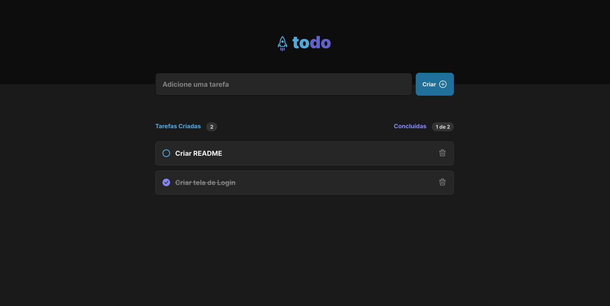

# ToDo List

## Descrição do Projeto

<p align="left">Esta aplicação tem como finalidade facilitar a organizaão do seu dia, além de listar suas atividades de maneira simples, é também possível marcá-las como comcluídas, e acompanhar quais tarefas já foram concluídas</p>


### Pré-requisitos

Antes de começar, você vai precisar ter instalado em sua máquina as seguintes ferramentas:
[Git](https://git-scm.com), [Node.js](https://nodejs.org/en/).
Além disto é bom ter um editor para trabalhar com o código como [VSCode](https://code.visualstudio.com/)


### Demostração

<h1 align="center">
  
</h1>


### Features

- [x] Cadastro de atividades
- [x] Marcar atividade como concluída
- [x] Exclusão de atividade


### Tecnologias

As seguintes ferramentas foram usadas na construção do projeto:

- [React](https://pt-br.reactjs.org/)
- [TypeScript](https://www.typescriptlang.org/)
- [ViteJs](https://vitejs.dev/guide/)


### Instalação

```bash
# Clone este repositório
$ git clone <https://github.com/Lucasedusi/todo-vite-react.git>

# Acesse a pasta do projeto no terminal/cmd
$ cd todo-vite-react

# Instale as dependências
$ yarn install

# Execute a aplicação em modo de desenvolvimento
$ yarn dev

# O servidor inciará na porta:5173 - acesse <http://localhost:5173>
```


### Autor
---

<a href="https://blog.rocketseat.com.br/author/thiago/">
 
 <br />
 <sub><b>Lucas Eduardo</b></sub></a> <a href="https://www.linkedin.com/in/lucas-eduardo-pereira-andrade-8224751b2/" title="">🚀</a>


Feito com ❤️ por Lucas Eduardo 👋🏽 Entre em contato!

[](https://www.linkedin.com/in/lucas-eduardo-pereira-andrade-8224751b2/)
[](mailto:lucaseduardodev@gmail.com)
